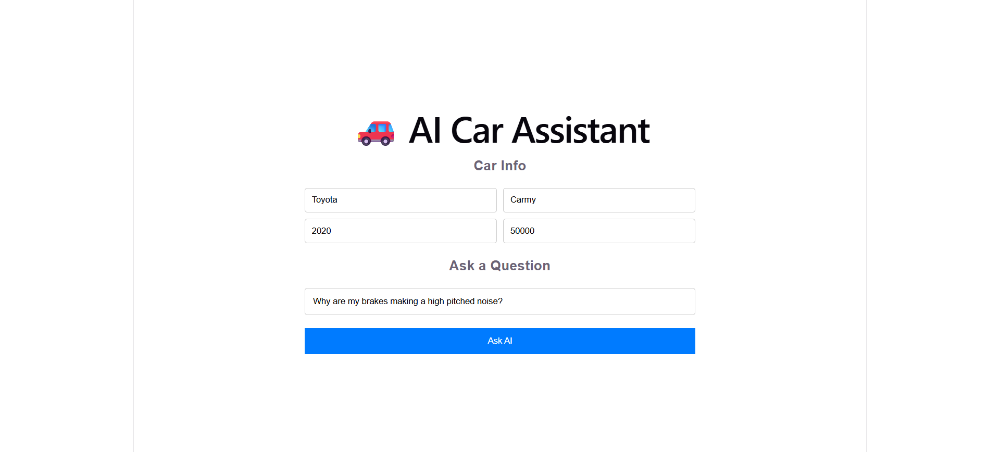
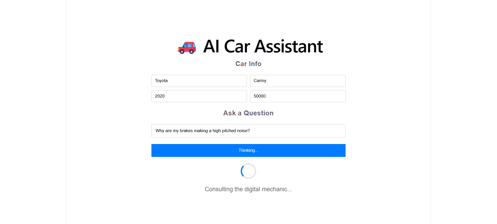
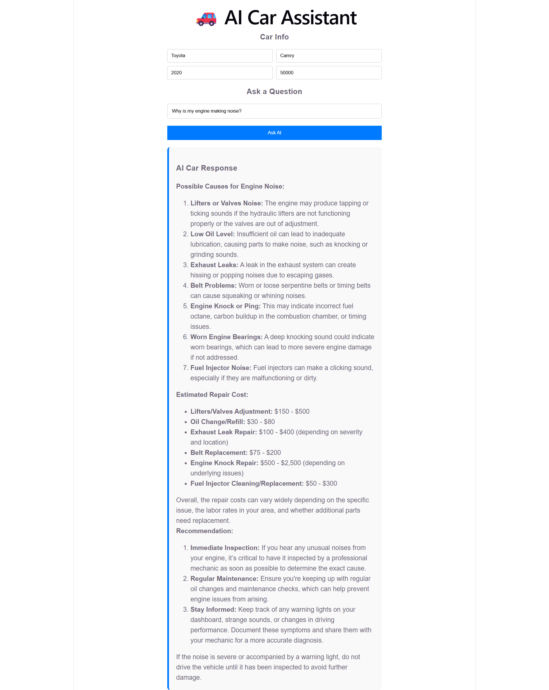

## AI Car Assistant


<div align="left">
  
  
  
  
  
  
</div>


An AI-powered application that helps drivers diagnose car problems and estimate repair costs.

## 🚀 Features
- **Intelligent Diagnostics**: Natural language processing to diagnose car symptoms.
- **Personalized Insights**: Tailored responses based on your car's make, model, year, and mileage.
- **RAG Architecture**: Knowledge retrieval for accurate, context-aware advice.
- **High-Performance Caching**: Redis integration to reduce latency and optimize AI API costs.
- **Maintenance Tracking**: Keep a history of your vehicle's service records.


## 🏗️ Project Architecture
The system follows a microservices approach, utilizing Docker to manage containerized components.

```text
ai-car-assistant/
├── backend/          # FastAPI application & business logic
├── frontend/         # React + TypeScript SPA
└── images/           # Documentation assets
└── scripts/ 
├── docker-compose.yml # Orchestration of containers
└── README.md
```


## 🛠️ Tech Stack
- **Frontend**: React, TypeScript, Axios, JWT Authentication
- **Backend**: Python, FastAPI
- **AI Engine**: OpenAI API with RAG (Retrieval-Augmented Generation)
- **Database**: PostgreSQL, SQLite
- **Caching**: Redis
- **DevOps**: Docker, Docker Compose

## 🚀 Getting Started

#### Prerequisites
- Docker Desktop installed
- Node.js (v20+) and Python (v3.11+)

#### Installation

1. Clone the repository:

```bash
git clone https://github.com/sanjoy-kumar/ai-car-assistant.git
cd ai-car-assistant
```

2. Configure Environment Variables:

    Create a **.env** file in both **/backend** and **/frontend** directories using the provided templates in the source code.

3. Launch the System:
To run the entire stack using Docker Compose:

```bash
docker-compose up --build
```
## 🌐 Service Access

| Service | URL |
| :--- | :--- |
| Frontend | http://localhost:3000 |
| Backend | http://localhost:8000 |
| API Docs | http://localhost:8000/docs |
| Database | localhost:5432 |


## 📸 System Overview








## 🤝 Contributing

Contributions are welcome!

1. Fork the Project
2. Create your Feature Branch (git checkout -b feature/AmazingFeature)
3. Commit your Changes (git commit -m 'Add some AmazingFeature')
4. Push to the Branch (git push origin feature/AmazingFeature)
5. Open a Pull Request

## 🛡️ License

Distributed under the MIT License. See LICENSE for more information.

## 👨‍💻 Author

Sanjoy Kumar Das |  [GitHub](https://github.com/sanjoy-kumar)


